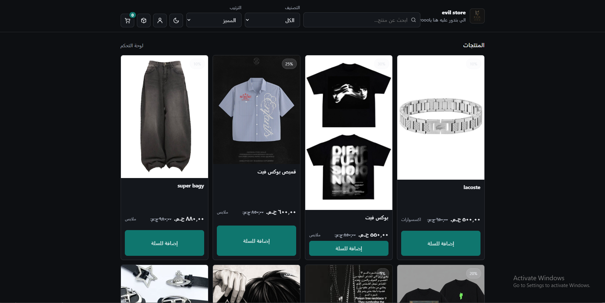
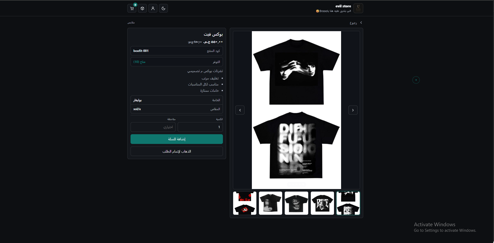
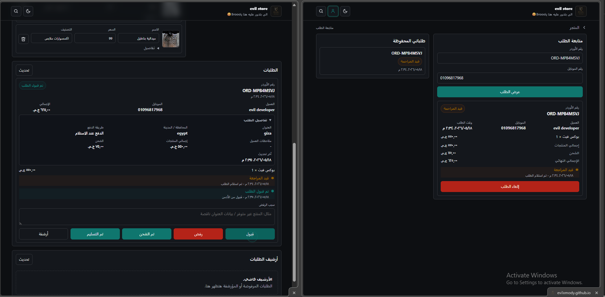
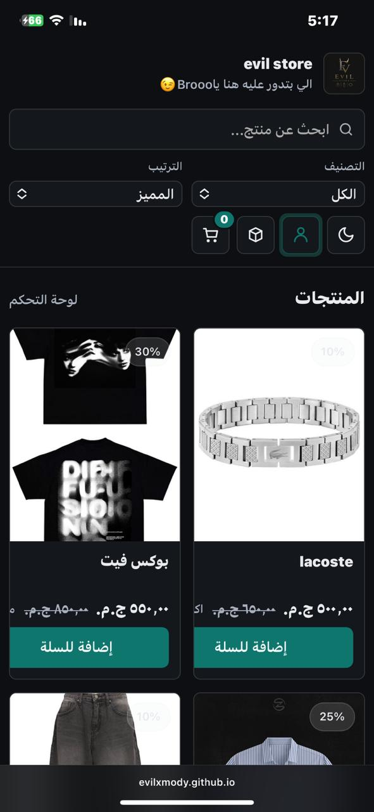

# EVIL STORE 🛒🔥

<div align="center">


### ⚡ Modern Store Website Built With Pure Frontend Magic

</div>

---

## 🚀 Preview

> A clean and modern online store UI with smooth animations, responsive design, and a dark aesthetic.

---

## ✨ Features

-📦 Dynamic Order Tracking
-✅ Admin Dashboard
-⚙️ GitHub JSON Database Workflow
-🌃%🌇 Light & Dark Themes
-📲 Mobile Admin Support
-✅ Real-Time Order Status Updates
-✅ Responsive UI/UX
- 🖤 Modern Dark UI
- ⚡ Fast & Responsive
- 📱 Mobile Friendly
- 🎨 Smooth Animations
- 🛒 Store Layout Design
- 🔥 Clean Code Structure
- 🌐 Easy Deployment

---

## 🛠️ Technologies Used

- HTML5
- CSS3
- JavaScript
- Responsive Design

---
## 🧠 System Workflow

EVIL STORE uses a lightweight dynamic workflow powered by GitHub-hosted JSON data.

Products, orders, themes, and tracking statuses are managed through a custom admin dashboard with mobile support.

The system allows:
- Dynamic order tracking
- Real-time status updates
- Order approval / rejection handling
- Shipping state management
- Theme switching (Light / Dark)
- Mobile-friendly administration

All changes are synchronized directly with GitHub, creating a backend-like experience without using traditional servers or databases.
---
## 📂 Project Structure

```bash
evil-store/
│
├── index.html
├── style.css
├── script.js
└── assets/
```

---

## ⚙️ Installation

Clone the repository:

```bash
git clone https://github.com/evilxmody/evil-store.git
```

## 🌍 Live Demo

### 🔗 Repository:

https://github.com/evilxmody/evil-store

---

## 📸 Screenshots

> show me yor screen shots for my repo 👀

## 📸 Screenshots

<div align="center">

### 🖥️ Home Page


### 🛒 Products Section

<br>


### 📱 Mobile View


</div>

---

## 🧠 Future Improvements

- 🛍️ Add Product API
- 💳 Payment Integration
- 🔐 Authentication System
- 🌙 Advanced Theme Customization
- 📦 Shopping Cart System

---


<div align="center">

 # 👑 Author

Built and designed with passion by **Mohamed Said**.

# 🌐 Connect With Me

<p align="center">

<a href="https://github.com/evilxmody">

</a>

<a href="https://www.facebook.com/EvilxMody">

</a>

<a href="https://www.instagram.com/evilxmody">

</a>

<a href="https://wa.me/201124145209">

</a>

<a href="https://www.linkin1.com/evilxmody0">

</a>

</p>

If you like this project, don't forget to leave a star on the repository ⭐
